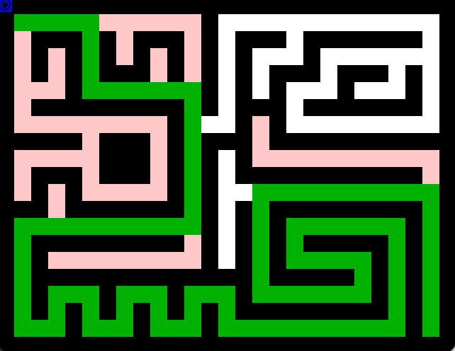

# Recursive Maze Solver 

> A program for solving mazes using recursion and animating the solution.

<a name="toc"/></a>
## Table of Contents

1. [Overview](#overview)

2. [Technologies](#technologies)

3. [Launch](#launch)

4. [Sample Output](#output)

<a name="overview"/></a>
## 1. Overview
[Back to ToC](#toc)

This is a program that uses recursion to solve mazes. The idea is that each location explored in the maze corresponds to a recursive call, and when the exit is found, the path taken from the start is stored implicitly on the call stack.

The program reads maze files in one of two ways: either from a command line argument, or from the standard input. The maze contents are stored in a 2D array, and the MazeViewer class is used to display the maze and animate the solution.

The recursive "solver" for the maze uses the following approach:

* Given a location and a map of the maze (showing walls, open regions, and areas that have been already explored), it determines whether the exit can be reached by moving through adjacent open squares without passing through a wall or previously visited square.
* The starting condition is that the map of the maze shows every open square as unexplored, and the location is the starting point.
* The stop criterion is based on two possibilities: success or failure. If the current location is the finish of the maze, the solver reports success and marks the current square as part of the path before returning true. If the current location is already visited or a wall, the solver returns false (indicating that this is not the correct path to the exit).
 
<a name="technologies"/></a>
## 2. Technologies
[Back to ToC](#toc)

java version "1.8.0_181"<br />
Java(TM) SE Runtime Environment (build 1.8.0_181-b13)<br />
Java HotSpot(TM) 64-Bit Server VM (build 25.181-b13, mixed mode)<br />

<a name="launch"/></a>
## 3. Launch
[Back to ToC](#toc)
```bash
javac -classpath .:target/dependency/* -d . $(find . -type f -name '*.java')

java MazeSolver mazefile

java MazeSolver < mazefile
```
<a name="technologies"/></a>
## 4. Sample Output
[Back to ToC](#toc)

<p align="center">

</p>
